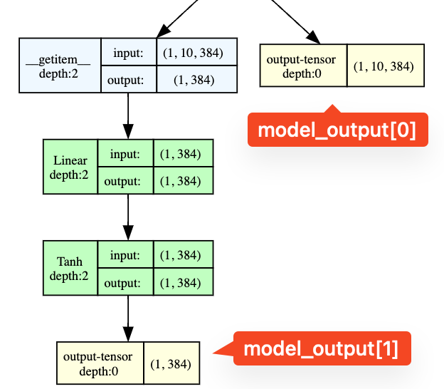

# matryoshka

```
tokenizer = AutoTokenizer.from_pretrained('sentence-transformers/all-MiniLM-L6-v2')
model = AutoModel.from_pretrained('sentence-transformers/all-MiniLM-L6-v2')
```

### Early results
Implemented the unsupervised part of *Matryoshka-Adaptor: Unsupervised and Supervised Tuning for Smaller Embedding Dimensions*, by training with pairwise loss, top-k loss, and regularization loss. Only the adaptor parameters were trained. Adaptor consists of down-, and up-projection layers with ReLU non-linearity, a layernorm and a skip-connection. Training and testing was done using BEIR task data: NFCorpus.

- Only including all of the above steps allows bringing the performance of adaptor embeddings to the base model embeddings, sometimes surpassing them by a tiny margin
- Partial and final results are available in `eval_gather.ipynb`

### Low Hanging Fruits
- Try different adaptor architectures (deeper, with attention etc.)
- Pre-compute base embeddings to speed up training
- More training data
- Eval BEIR during training to skip postprocessing

### Outputs


**model(x) output:**
```python
model_output is a tuple
model_output[0] -- embedding per token -> [batch, tokens, 384]
model_output[1] -- embedding per token + pooling -> [batch, 384]
```

**model pooler:**
```python
(pooler): BertPooler(
    (dense): Linear(in_features=384, out_features=384, bias=True)
    (activation): Tanh()
)
```

Instead of pooling in classical sense (aggregation statistic), it takes the CLS token from first postion per each batch item. 


### BEIR

BEIR data organization is an eldritchian horror. If you look at it in a HuggingFace viewer -- it doesn't make any sense. You have queries and text "passages", that you're suppossed to retrieve. But how do they link? What's going on? It's not there. We don't see it. Turns out the right way is to either download a raw dataset and look inside yourself or use the original BEIR script. 

BEIR script is easier.

```python
from beir import util, LoggingHandler
from beir.retrieval import models
from beir.datasets.data_loader import GenericDataLoader
from beir.retrieval.evaluation import EvaluateRetrieval
from beir.retrieval.search.dense import DenseRetrievalExactSearch as DRES

import logging
import pathlib, os

#### Just some code to print debug information to stdout
logging.basicConfig(format='%(asctime)s - %(message)s',
                    datefmt='%Y-%m-%d %H:%M:%S',
                    level=logging.INFO,
                    handlers=[LoggingHandler()])
#### /print debug information to stdout

#### Download scifact.zip dataset and unzip the dataset
dataset = "nfcorpus"
url = "https://public.ukp.informatik.tu-darmstadt.de/thakur/BEIR/datasets/{}.zip".format(dataset)
out_dir = os.path.join("data")
data_path = util.download_and_unzip(url, out_dir)

#### Provide the data_path where scifact has been downloaded and unzipped
corpus, queries, qrels = GenericDataLoader(data_folder=data_path).load(split="test")

length = None
corpus = {k: v for k, v in list(corpus.items())[:length]}
queries = {k: v for k, v in list(queries.items())[:10]}
qrels = {k: v for k, v in list(qrels.items())[:length]}
```

Here:
 - corpus: text "passages" (sentences) (with ids) that we are suppossed to retrieve
 - queries: we take these and try to match them with correct corpus text passages
 - qrels: the whole gist, this matches ids of queries with ids of corpus texts, each connection is assigned an importance value, 2 for highly relevant, 1 for less relevant, no connection if irrelevant (I think)

### Matryoshka-Adaptor: Unsupervised and Supervised Tuning for Smaller Embedding Dimensions

##### Losses 

All losses are computed purely from a perspective of a current batch. However it could be beneficial for the toph loss to precompute embeddings and topk per embedding before the training, so that we try to preserve locality with a broader perspective.

### Pairwise Loss

```python
class PairwiseSimilarityLossParallel(nn.Module):
    def __init__(self):
        super(PairwiseSimilarityLossParallel, self).__init__()

    def forward(self, embeddings, adapted_embeddings, m_list, reduce=True):
        loss = 0.0
        counter = 0
        partial_counter = 0

        partial_loss = {m: 0.0 for m in m_list}

        # something is potentially wrong with indexing, single check yields correct loss
        for i in range(len(embeddings)):
            cloned_target = embeddings[i].unsqueeze(0).repeat(len(embeddings), 1)
            target_similarity = F.cosine_similarity(cloned_target[i:], embeddings[i:], dim=1)
            cloned_adapted = adapted_embeddings[i].unsqueeze(0).repeat(len(adapted_embeddings), 1)
            for m in m_list:
                reduced_similarity = F.cosine_similarity(cloned_adapted[i:, :m], adapted_embeddings[i:, :m], dim=1)
                loss += torch.sum(torch.abs((reduced_similarity - target_similarity)))
                partial_loss[m] += torch.sum(torch.abs((reduced_similarity - target_similarity)))
                counter += len(target_similarity)
            partial_counter += len(target_similarity)

        if reduce:
            partial_counter = counter // len(m_list)
            return loss / counter, {m: loss / partial_counter for m, loss in partial_loss.items()}
        return loss, partial_loss
```

### Regularization Loss

```python
class RegularizingLoss(nn.Module):
    def __init__(self):
        super(RegularizingLoss, self).__init__()

    def forward(self, embeddings, adapted_embeddings):
        loss = 0.0
        for i in range(len(embeddings)):
            loss += torch.abs(embeddings[i] - adapted_embeddings[i])
        return loss.mean()
```

### Top-K Loss

```python
class TopKSimilarityLoss(nn.Module):
    def __init__(self, k=5):
        super(TopKSimilarityLoss, self).__init__()
        self.k = k

    def forward(self, embeddings, adapted_embeddings, m_list):
        sims = torch.triu(torch.matmul(embeddings, embeddings.T), diagonal=1)
        topk_val, topk_idx = torch.topk(sims, self.k, dim=1)

        mask = torch.zeros_like(sims, dtype=torch.bool)
        mask.scatter_(1, topk_idx, True)
        masked_sims = sims * mask

        for m in m_list:
            reduced_sims = torch.triu(torch.matmul(adapted_embeddings[:, :m], adapted_embeddings[:, :m].T), diagonal=1)
            masked_reduced_sims = reduced_sims * mask
            loss = torch.abs(masked_sims - masked_reduced_sims)
            loss = loss.mean()

        reducer = torch.sum(topk_val.reshape(-1).where(topk_val.reshape(-1) == 0, 1))
        return loss / reducer
```
